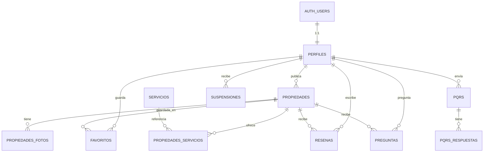

# Plan de Acción — Uniarriendos

Plataforma web colaborativa para búsqueda de arriendos de la comunidad UNIPAZ.  
**Stack:** Next.js 16 + Supabase + Cloudinary + Leaflet/Google Maps  

---

## Bocetos de Referencia

````carousel

<!-- slide -->

<!-- slide -->

<!-- slide -->

<!-- slide -->

<!-- slide -->

<!-- slide -->

<!-- slide -->

````

---

## 1. Diseño Entidad-Relación — Supabase

> [!IMPORTANT]
> Supabase usa `auth.users` como tabla de autenticación nativa. Nuestra tabla `perfiles` se vincula 1:1 con `auth.users.id` como FK. **No crear tabla de usuarios aparte para auth.**

### 1.1 Diagrama ER



### 1.2 Definición de Tablas

#### `perfiles`
Extiende `auth.users` con datos del perfil público.

| Columna | Tipo | Restricción | Descripción |
|---------|------|-------------|-------------|
| `id` | `uuid` | PK, FK → `auth.users.id` ON DELETE CASCADE | Vinculo 1:1 con auth |
| `nombre_completo` | `varchar(120)` | NOT NULL | Nombres y apellidos |
| `telefono` | `varchar(15)` | NULLABLE | Contacto (requerido para publicar) |
| `fecha_nacimiento` | `date` | NULLABLE | Fecha de nacimiento |
| `avatar_url` | `text` | NULLABLE | URL de Cloudinary |
| `rol` | `enum('usuario','admin')` | DEFAULT 'usuario' | Rol en plataforma |
| `estado` | `enum('activo','suspendido','baneado')` | DEFAULT 'activo' | Estado de la cuenta |
| `observaciones_baneo` | `text` | NULLABLE | Razón si fue baneado |
| `created_at` | `timestamptz` | DEFAULT now() | Fecha de registro |
| `updated_at` | `timestamptz` | DEFAULT now() | Última actualización |

> [!NOTE]
> El correo institucional (`@unipaz.edu.co`) se gestiona desde `auth.users.email`. No se duplica aquí.

---

#### `propiedades`
Tabla principal de inmuebles publicados.

| Columna | Tipo | Restricción | Descripción |
|---------|------|-------------|-------------|
| `id` | `bigint` | PK, autoincrement | ID de propiedad |
| `propietario_id` | `uuid` | FK → `perfiles.id` ON DELETE CASCADE | Anfitrión |
| `titulo` | `varchar(150)` | NOT NULL | Nombre/título |
| `descripcion` | `text` | NOT NULL, CHECK(length >= 20) | Descripción breve |
| `precio` | `integer` | NOT NULL, CHECK(precio > 50000) | Precio mensual COP |
| `ubicacion_texto` | `varchar(200)` | NOT NULL | Dirección legible |
| `ubicacion_lat` | `double precision` | NULLABLE | Latitud (para mapa) |
| `ubicacion_lng` | `double precision` | NULLABLE | Longitud (para mapa) |
| `estado` | `enum('disponible','ocupado','en_revision','suspendido','baneado')` | DEFAULT 'disponible' | Estado público |
| `prioridad` | `enum('comun','verificada','recomendada')` | DEFAULT 'comun' | Nivel de visibilidad |
| `vivienda_compartida` | `boolean` | DEFAULT false | ¿Es compartida? |
| `perfil_arriendo` | `enum('estudiante','externo','ambos')` | DEFAULT 'ambos' | Público objetivo |
| `verificada` | `boolean` | DEFAULT false | Verificada por admin |
| `observaciones_admin` | `text` | NULLABLE | Nota si fue suspendida |
| `normas_convivencia_url` | `text` | NULLABLE | Documento .docx |
| `created_at` | `timestamptz` | DEFAULT now() | Fecha de creación |
| `updated_at` | `timestamptz` | DEFAULT now() | Última edición |

---

#### `propiedades_fotos`

| Columna | Tipo | Restricción | Descripción |
|---------|------|-------------|-------------|
| `id` | `bigint` | PK | ID de foto |
| `propiedad_id` | `bigint` | FK → `propiedades.id` ON DELETE CASCADE | Propiedad |
| `url` | `text` | NOT NULL | URL Cloudinary |
| `es_principal` | `boolean` | DEFAULT false | Foto portada |
| `orden` | `smallint` | DEFAULT 0 | Orden de visualización |

> CHECK: Mínimo 1 foto, máximo 5 por propiedad (validar en app layer).

---

#### `servicios` (catálogo)

| Columna | Tipo | Restricción |
|---------|------|-------------|
| `id` | `smallint` | PK |
| `nombre` | `varchar(50)` | UNIQUE, NOT NULL |
| `icono` | `varchar(30)` | Nombre del ícono |

**Seed data:** WiFi, Parqueadero, Aire Acondicionado, Mascotas, Cocina, TV, Baño Privado, Lavadora, Amoblado, Agua Caliente.

---

#### `propiedades_servicios` (relación N:N)

| Columna | Tipo | Restricción |
|---------|------|-------------|
| `propiedad_id` | `bigint` | FK → `propiedades.id` ON DELETE CASCADE |
| `servicio_id` | `smallint` | FK → `servicios.id` |
| PK compuesta | | (`propiedad_id`, `servicio_id`) |

> CHECK: Mínimo 3 servicios por propiedad (validar en app layer).

---

#### `favoritos`

| Columna | Tipo | Restricción |
|---------|------|-------------|
| `usuario_id` | `uuid` | FK → `perfiles.id` ON DELETE CASCADE |
| `propiedad_id` | `bigint` | FK → `propiedades.id` ON DELETE CASCADE |
| `created_at` | `timestamptz` | DEFAULT now() |
| PK compuesta | | (`usuario_id`, `propiedad_id`) |

---

#### `resenas` *(standby — preparar estructura)*

| Columna | Tipo | Restricción |
|---------|------|-------------|
| `id` | `bigint` | PK |
| `propiedad_id` | `bigint` | FK → `propiedades.id` |
| `usuario_id` | `uuid` | FK → `perfiles.id` |
| `calificacion` | `smallint` | CHECK(1-5) |
| `comentario` | `text` | NOT NULL |
| `reportada` | `boolean` | DEFAULT false |
| `created_at` | `timestamptz` | DEFAULT now() |

---

#### `preguntas` *(standby — preparar estructura)*

| Columna | Tipo | Restricción |
|---------|------|-------------|
| `id` | `bigint` | PK |
| `propiedad_id` | `bigint` | FK → `propiedades.id` |
| `usuario_id` | `uuid` | FK → `perfiles.id` |
| `pregunta` | `text` | NOT NULL |
| `respuesta` | `text` | NULLABLE |
| `respondida_at` | `timestamptz` | NULLABLE |
| `created_at` | `timestamptz` | DEFAULT now() |

---

#### `pqrs`

| Columna | Tipo | Restricción |
|---------|------|-------------|
| `id` | `bigint` | PK |
| `usuario_id` | `uuid` | FK → `perfiles.id` |
| `tipo` | `enum('peticion','queja','reclamo','sugerencia')` | NOT NULL |
| `asunto` | `varchar(200)` | NOT NULL |
| `mensaje` | `text` | NOT NULL |
| `estado` | `enum('pendiente','en_proceso','resuelto')` | DEFAULT 'pendiente' |
| `created_at` | `timestamptz` | DEFAULT now() |

---

#### `pqrs_respuestas`

| Columna | Tipo | Restricción |
|---------|------|-------------|
| `id` | `bigint` | PK |
| `pqrs_id` | `bigint` | FK → `pqrs.id` |
| `admin_id` | `uuid` | FK → `perfiles.id` |
| `respuesta` | `text` | NOT NULL |
| `created_at` | `timestamptz` | DEFAULT now() |

---

#### `suspensiones`

| Columna | Tipo | Restricción |
|---------|------|-------------|
| `id` | `bigint` | PK |
| `usuario_id` | `uuid` | FK → `perfiles.id` |
| `admin_id` | `uuid` | FK → `perfiles.id` |
| `nivel` | `smallint` | CHECK(1-3): 1=1mes, 2=3meses, 3=ban |
| `motivo` | `text` | NOT NULL |
| `fecha_inicio` | `timestamptz` | DEFAULT now() |
| `fecha_fin` | `timestamptz` | NULLABLE (null = permanente) |

---

### 1.3 Políticas RLS (Row Level Security)

> [!IMPORTANT]
> Activar RLS en **TODAS** las tablas. Cada política usa `auth.uid()` para identificar al usuario autenticado.

#### Función auxiliar (crear primero)

```sql
-- Función para obtener el rol del usuario autenticado
CREATE OR REPLACE FUNCTION public.get_user_role()
RETURNS text AS $$
  SELECT rol FROM public.perfiles WHERE id = auth.uid();
$$ LANGUAGE sql SECURITY DEFINER STABLE;

-- Función para verificar si el usuario está activo
CREATE OR REPLACE FUNCTION public.is_user_active()
RETURNS boolean AS $$
  SELECT estado = 'activo' FROM public.perfiles WHERE id = auth.uid();
$$ LANGUAGE sql SECURITY DEFINER STABLE;
```

#### Políticas por tabla

| Tabla | Operación | Política | Condición |
|-------|-----------|----------|-----------|
| **perfiles** | SELECT | Todos ven perfiles públicos | `true` |
| **perfiles** | UPDATE | Solo el dueño edita su perfil | `id = auth.uid()` |
| **perfiles** | UPDATE | Admin puede editar cualquiera | `get_user_role() = 'admin'` |
| **propiedades** | SELECT | Ver disponibles/ocupadas | `estado IN ('disponible','ocupado')` |
| **propiedades** | SELECT | Admin ve todas | `get_user_role() = 'admin'` |
| **propiedades** | SELECT | Propietario ve las suyas | `propietario_id = auth.uid()` |
| **propiedades** | INSERT | Usuario activo crea | `propietario_id = auth.uid() AND is_user_active()` |
| **propiedades** | UPDATE | Propietario edita suya | `propietario_id = auth.uid()` |
| **propiedades** | UPDATE | Admin edita cualquiera | `get_user_role() = 'admin'` |
| **propiedades** | DELETE | Propietario elimina suya | `propietario_id = auth.uid()` |
| **favoritos** | ALL | Solo el dueño | `usuario_id = auth.uid()` |
| **pqrs** | INSERT | Usuario autenticado crea | `usuario_id = auth.uid()` |
| **pqrs** | SELECT | Dueño ve las suyas | `usuario_id = auth.uid()` |
| **pqrs** | SELECT/UPDATE | Admin ve y gestiona todas | `get_user_role() = 'admin'` |
| **suspensiones** | INSERT | Solo admin | `get_user_role() = 'admin'` |
| **suspensiones** | SELECT | Dueño ve las suyas | `usuario_id = auth.uid()` |

---

### 1.4 Storage Buckets (Supabase Storage + Cloudinary)

| Bucket | Uso | Políticas |
|--------|-----|-----------|
| `avatars` | Fotos de perfil | Upload: solo el dueño. Public read |
| `normas` | Documentos .docx | Upload: propietario. Read: autenticados |

> [!TIP]
> Las **fotos de propiedades** van a **Cloudinary** directamente (no a Supabase Storage) para optimización automática, CDN y transformaciones de imagen. Las URLs se guardan en `propiedades_fotos.url`.

---

### 1.5 Triggers Importantes

```sql
-- Auto-crear perfil al registrarse un usuario
CREATE OR REPLACE FUNCTION public.handle_new_user()
RETURNS trigger AS $$
BEGIN
  INSERT INTO public.perfiles (id, nombre_completo)
  VALUES (NEW.id, NEW.raw_user_meta_data->>'nombre_completo');
  RETURN NEW;
END;
$$ LANGUAGE plpgsql SECURITY DEFINER;

CREATE TRIGGER on_auth_user_created
  AFTER INSERT ON auth.users
  FOR EACH ROW EXECUTE FUNCTION public.handle_new_user();

-- Auto-actualizar updated_at
CREATE OR REPLACE FUNCTION public.update_timestamp()
RETURNS trigger AS $$
BEGIN
  NEW.updated_at = now();
  RETURN NEW;
END;
$$ LANGUAGE plpgsql;

-- Aplicar a perfiles y propiedades
CREATE TRIGGER update_perfiles_timestamp
  BEFORE UPDATE ON perfiles FOR EACH ROW EXECUTE FUNCTION update_timestamp();
CREATE TRIGGER update_propiedades_timestamp
  BEFORE UPDATE ON propiedades FOR EACH ROW EXECUTE FUNCTION update_timestamp();
```

---

## 2. Estructura del Proyecto Next.js

```
src/
├── app/
│   ├── (public)/                  # Rutas públicas (sin auth)
│   │   ├── page.tsx               # Home / Landing
│   │   ├── explorar/
│   │   │   └── page.tsx           # Explorador (lista + mapa)
│   │   ├── propiedad/[id]/
│   │   │   └── page.tsx           # Detalle de propiedad
│   │   └── nosotros/
│   │       └── page.tsx           # Acerca de
│   ├── (auth)/                    # Rutas de autenticación
│   │   ├── login/page.tsx
│   │   └── registro/page.tsx
│   ├── (dashboard)/               # Rutas privadas (requiere auth)
│   │   ├── perfil/page.tsx
│   │   ├── favoritos/page.tsx
│   │   ├── mis-propiedades/
│   │   │   ├── page.tsx           # Lista de propiedades del anfitrión
│   │   │   ├── nueva/page.tsx     # Formulario crear
│   │   │   └── [id]/editar/page.tsx
│   │   └── pqrs/
│   │       ├── page.tsx           # Mis PQRS
│   │       └── nueva/page.tsx     # Crear PQRS
│   ├── (admin)/                   # Panel de administración
│   │   └── admin/
│   │       ├── page.tsx           # Dashboard admin
│   │       ├── usuarios/page.tsx
│   │       ├── propiedades/page.tsx
│   │       └── pqrs/page.tsx
│   ├── layout.tsx
│   └── globals.css
├── componentes/
│   ├── layout/
│   │   ├── Navbar/
│   │   └── Footer/
│   ├── ui/
│   │   ├── PropertyCard/
│   │   ├── PropertyGrid/
│   │   ├── SearchBar/
│   │   ├── FilterSidebar/
│   │   ├── MapView/
│   │   ├── ImageGallery/
│   │   ├── Modal/
│   │   └── Badge/
│   ├── forms/
│   │   ├── LoginForm/
│   │   ├── RegisterForm/
│   │   ├── PropertyForm/
│   │   └── PqrsForm/
│   └── auth/
│       └── AuthProvider.tsx
├── lib/
│   ├── supabase/
│   │   ├── client.ts              # Cliente browser
│   │   ├── server.ts              # Cliente server (SSR)
│   │   └── middleware.ts          # Middleware de auth
│   ├── cloudinary.ts
│   └── types/
│       └── database.types.ts      # Tipos auto-generados
├── hooks/
│   ├── useAuth.ts
│   ├── useProperties.ts
│   └── useFavorites.ts
└── middleware.ts                   # Protección de rutas
```

---

## 3. Fases de Desarrollo

### Fase 1 — Fundación y Auth *(Semana 1-2)*

> Supabase DB + Autenticación + Layout base

| Tarea | Detalle |
|-------|---------|
| Crear tablas en Supabase | `perfiles`, `propiedades`, `propiedades_fotos`, `servicios`, `propiedades_servicios` |
| Configurar enums | Estados, roles, prioridades |
| Activar RLS | Todas las tablas con políticas base |
| Crear triggers | `handle_new_user`, `update_timestamp` |
| Seed data servicios | WiFi, Parqueadero, Aire, etc. |
| Refactorizar cliente Supabase | Separar client/server con `@supabase/ssr` |
| Auth: Login + Registro | Modales con validación correo `@unipaz.edu.co` |
| AuthProvider + middleware | Protección de rutas privadas |
| Layout: Navbar dinámica | Mostrar usuario/logout si autenticado |
| Layout: Footer | Según boceto (Privacidad, Términos, Soporte) |

---

### Fase 2 — Explorador y Propiedades *(Semana 3-4)*

> Vistas públicas principales

| Tarea | Detalle |
|-------|---------|
| Home / Landing | Hero con imagen, CTA "Explorar Arriendos" |
| Explorador vista lista | Grid de PropertyCards con buscador |
| PropertyCard mejorada | Según boceto: anfitrión, estado, calificación, favorito, servicios |
| Filtrado rápido | Sidebar: perfil de arriendo, servicios incluidos |
| Explorador vista mapa | Toggle Normal/Mapa con Leaflet, markers con preview |
| Detalle de propiedad | Galería fotos, info anfitrión, mapa, servicios, descripción |
| Búsqueda | Buscar por nombre de propiedad o zona |
| Compartir propiedad | Botón share con link |

---

### Fase 3 — Panel de Anfitrión *(Semana 5-6)*

> CRUD de propiedades

| Tarea | Detalle |
|-------|---------|
| Dashboard "Mis Propiedades" | Lista con estado y acciones |
| Formulario crear propiedad | Título, ubicación, precio, fotos (Cloudinary), servicios, descripción |
| Upload de fotos | Drag & Drop → Cloudinary, mín 1 máx 5 |
| Selector de ubicación | Mapa interactivo para marcar coordenadas |
| Editar propiedad | Pre-cargar datos, cambiar estado (disponible/ocupado) |
| Eliminar propiedad | Confirmación con contraseña |
| Perfil de usuario | Editar nombre, avatar, teléfono |
| Favoritos | Lista de propiedades guardadas |

---

### Fase 4 — Panel Admin *(Semana 7-8)*

> Gestión y moderación

| Tarea | Detalle |
|-------|---------|
| Dashboard admin | Estadísticas generales |
| Gestión usuarios | Listar, buscar, cambiar rol, suspender, banear |
| Gestión propiedades | Listar, cambiar estado, prioridad, verificar, banear |
| Sistema de suspensiones | 3 niveles automáticos (1 mes, 3 meses, ban) |
| PQRS | Buzón con filtros, responder |
| Notificaciones básicas | Correo al cambiar estado de propiedad |

---

### Fase 5 — Funcionalidades Avanzadas *(Semana 9+, standby)*

| Tarea | Estado |
|-------|--------|
| Búsqueda con IA (lenguaje natural) | Standby |
| Mejora de descripción con IA | Standby |
| Reseñas con filtro de palabras | Standby |
| Preguntas al anfitrión | Standby |
| Validación automática de fotos | Standby |
| Mapa con rutas COTSEM | Standby |

---

## 4. Dependencias a Instalar

```bash
# Ya instalados
# next, react, react-dom, @supabase/supabase-js, @supabase/ssr

# Por instalar
npm install leaflet react-leaflet  # Mapas
npm install @types/leaflet -D      # Tipos
npm install cloudinary             # Upload de imágenes (server-side)
npm install next-cloudinary        # Componentes React para Cloudinary
npm install react-dropzone         # Drag & Drop de archivos
npm install react-hot-toast        # Notificaciones toast
npm install lucide-react           # Íconos modernos
```

---

## Open Questions

> [!IMPORTANT]
> **1. Correo institucional obligatorio:**  
> ¿El registro debe ser **exclusivamente** con correo `@unipaz.edu.co`, o se permitirá registro con cualquier correo marcando si es estudiante/externo?

> [!IMPORTANT]
> **2. Tabla `propiedades` actual en Supabase:**  
> Vi que ya tienes una tabla `propiedades` con 3 registros de prueba y estructura básica (id, created_at, titulo, descripcion, precio, ubicacion, imagen_url). ¿Quieres que la **migre/recree** con la nueva estructura completa, o prefieres crear un proyecto Supabase nuevo?

> [!WARNING]
> **3. API Keys expuestas:**  
> El archivo `.env.local` tiene la URL y ANON_KEY de Supabase. Si el repo es público, la ANON_KEY está protegida por RLS, pero asegúrate de **nunca** usar la SERVICE_ROLE_KEY en el cliente.

> [!NOTE]
> **4. Cloudinary:**  
> ¿Ya tienes cuenta de Cloudinary creada? Necesitaremos el `cloud_name`, `api_key` y `api_secret` para configurar el upload de imágenes.

> [!NOTE]
> **5. Funcionalidades standby:**  
> Las funcionalidades marcadas como "standby" en tus documentos (IA, reseñas, preguntas, mapa COTSEM) las dejé en Fase 5. ¿Quieres priorizar alguna antes?

---

## Verification Plan

### Automated
- `npm run build` — Verificar que compila sin errores en cada fase
- `npm run lint` — ESLint sin warnings
- Queries de prueba en Supabase SQL Editor para validar RLS

### Manual
- Probar flujo completo: registro → login → explorar → crear propiedad → admin
- Verificar RLS: que un usuario NO pueda ver/editar datos de otro
- Responsive: probar en móvil (Mobile-First)
- Verificar que las imágenes cargan correctamente desde Cloudinary
